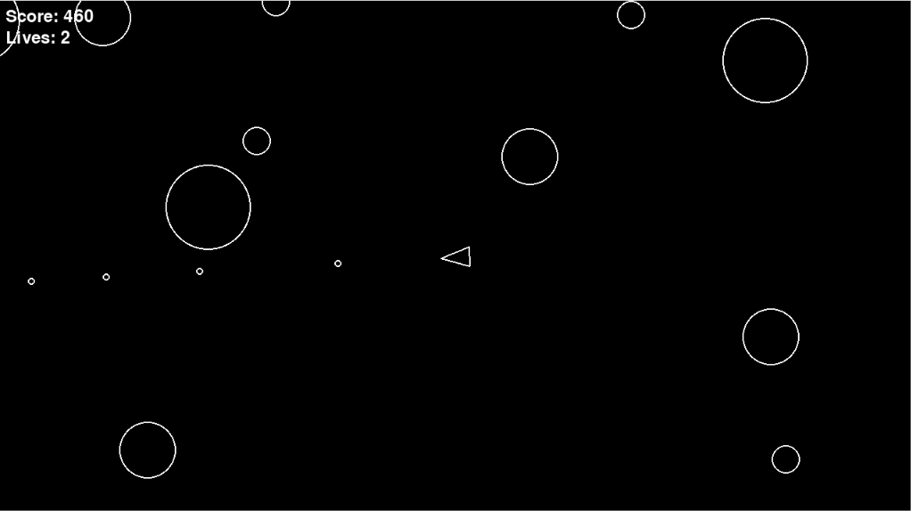

# Asteroids Game



A classic **Asteroids arcade game** built with **Python and Pygame**. The player controls a spaceship, destroys asteroids, earns points, and tries to survive as long as possible.

## Features

- Player movement and rotation
- Shooting mechanics
- Asteroid spawning and movement
- Collision detection
- Asteroid splitting system
- Score tracking
- Multiple lives system
- Player respawning after collisions
- Scoreboard display

## Technologies Used

- Python
- Pygame
- uv (Python package and project manager)

## Project Structure

```text
asteroids/
│
├── assets/
│   └── asteroid.png
│
├── main.py
├── player.py
├── asteroid.py
├── asteroidfield.py
├── shot.py
├── circleshape.py
├── scoreboard.py
├── gamestate.py
├── constants.py
├── logger.py
├── pyproject.toml
└── uv.lock
```

## Installation & Running

### Clone the repository

```bash
git clone <repository-url>
cd asteroids
```

### Install dependencies

Make sure you have `uv` installed, then run:

```bash
uv sync
```

### Start the game

Run:

```bash
uv run main.py
```

## Controls

| Key          | Action        |
| ------------ | ------------- |
| W            | Move forward  |
| S            | Move backward |
| A            | Rotate left   |
| D            | Rotate right  |
| Space        | Shoot         |
| Close Window | Exit game     |

## Gameplay

- Destroy asteroids to increase your score.
- Larger asteroids split into smaller asteroids when destroyed.
- Avoid collisions to preserve your lives.
- After losing a life, the player respawns and continues playing.

## Author

Built as a learning project while practicing Python, object-oriented programming, and game development with Pygame.
